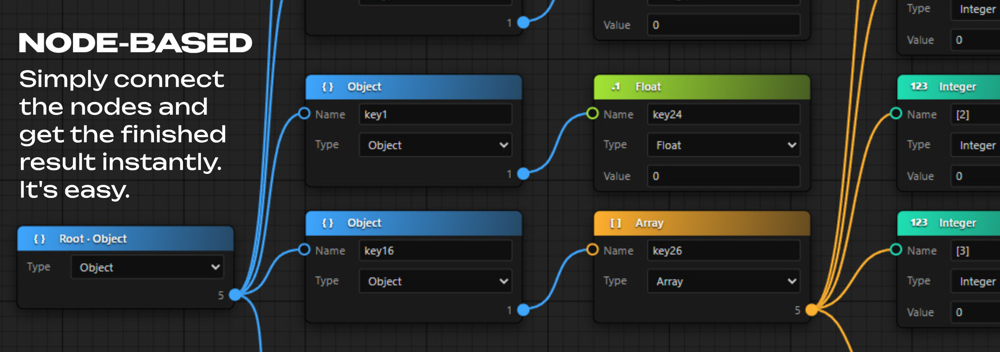
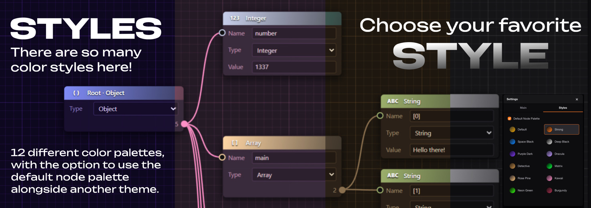
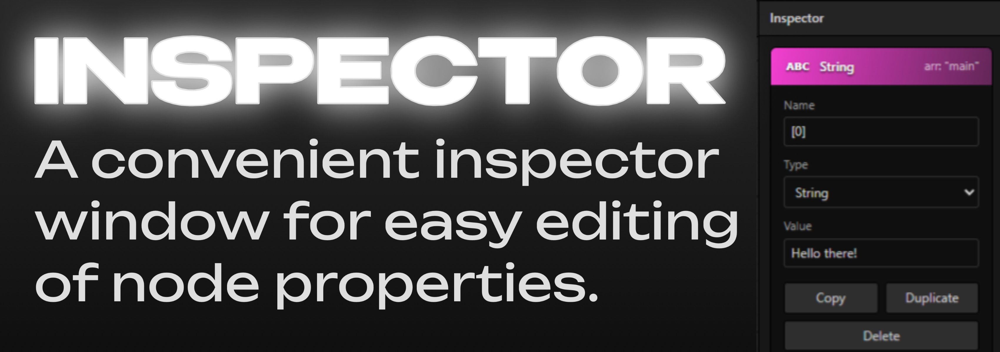

<h1 style="border-bottom: none">
    <b><a href="https://featured508.github.io/featured-json-editor/">Featured JSON Editor</a></b> 
    Create, edit and visualize a .json files
     
</h1>

 

  A privacy-focused, local-first and ready-to-use powerful editor for .json files. 
  Easy to use. Free to use. Directly in your browser.

## What is Featured JSON Editor?

[Featured JSON Editor](https://featured508.github.io/featured-json-editor/) is a powerful tool for **creating** and **editing** .json files using a intuitive node-based interface.

- **Edit nodes visually** and watch their values transform into valid JSON data in real time.
- **Import existing .json** files to instantly convert them into **structured**, interactive nodes and then **modify**, **duplicate** or **delete** them, with changes reflected immediately in the output.
- **Arrange nodes freely** on the canvas, or use the **Auto Arrange** feature to instantly organize everything into a **clean** and **readable layout**.

## Node-Based Editor
**The visual node editor** makes it easy to understand and manipulate complex JSON structures, while real-time validation ensures your data is **always correct**. Instantly spot syntax errors, missing brackets or invalid values before they cause issues in your applications.

## Styles
**Customize** your workspace with **12 color themes**, each offering a unique visual experience. Switch between palettes instantly to match your mood, time of day, or personal aesthetic preferences. It looks beautiful, doesn't it?

## Inspector
**The Inspector panel** on the right offers a list-based view for editing node properties. **Select multiple nodes** and **modify their values** in a scrollable interface. Quick actions like **Copy**, **Duplicate** and **Delete** let you manage nodes efficiently without cluttering the visual workspace.

## Features
- **Import .json:** Import your .json file or paste the one you've already copied.
- **Create an empty blueprint:** Build your .json file from scratch.
- **Arrange:** Instantly organize all nodes with a single click.
- **Snap to grid:** Use the snap-to-grid feature to position nodes evenly. Or position them however you like.
- **Zoom to fit:** Automatically moves the camera to fit all nodes in the view.
- **Export JSON:** Export the final result as a .json file or copy it.
- **JSON Indentation:** Select the number of spaces to use for indentation in the JSON file (Compact, 2 spaces, 3 spaces, 4 spaces).

## Keyboard Shortcuts
| Shortcut | Action |
|----------|--------|
| `L` | Select linked nodes |
| `A` | Select all nodes |
| `Del` / `X` | Delete selected nodes |
| `Ctrl + C` | Copy selected nodes |
| `Ctrl + V` | Paste copied nodes |
| `Ctrl + Z` | Undo last action |

> **Note:** On macOS, use `Cmd` instead of `Ctrl`.

## License

This project is licensed under the [MIT License](LICENSE).
